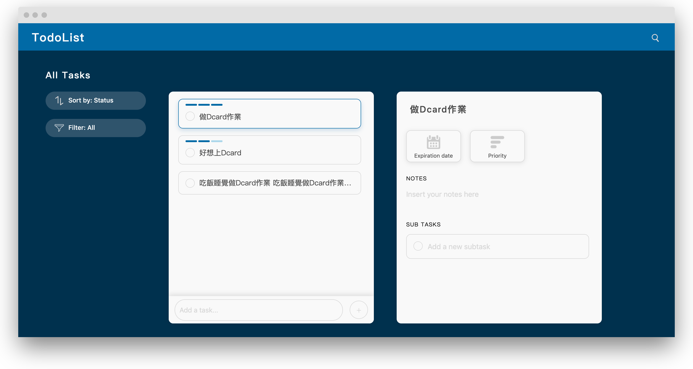

# React Hooks Todo App
> 2019 Dcard Web Development Intern - Take home test <br />
> Todo List Made By React Hooks



- **No** class components
- Uses `Context` to share a **global state**
- Uses `useReducer` to manage state actions
- `useState` to create local state
- Decoupled state logic (Actions)
- Testable components (Uses Jest + Enzyme for tests)
- Custom Hooks
- EsLint extends Airbnb style guide
- BEM naming with SCSS
- Babel and Webpack4

## Getting Started
1. Start developing.
    ```
    cd dcard_todolist/
    npm install
    npm start
    ```
2. My TodoList App is now running at http://localhost:3000

## Run Test
```
npm test
npm run coverage
```

## Building
```
npm run build
```
The build file will present in the `dist` folder.

## Features
1. Add a task.
2. Update the task.
3. Delete the task.
4. Detail information with notes, subtasks, due date and priority etc.
5. Sort with **Status**, **Time** (Ascending order), **Priority** (Descending order).
6. Filter with All / Active / Completed.
7. Search and AutoComplete.
8. Simple RWD layout.